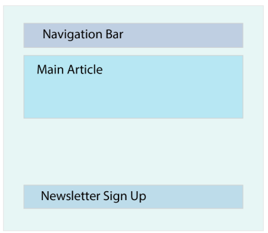

# React Components

## Lesson Overview

- Learn about React components
- Understand how to create React components
- Describe where components reside in a React project

### What are components?

- React allows you to break a UI down into independent reusable chunks (components)


    The website above could be broken into:

    1. App: Represents the main application and the parent of all other components
    2. Navbar: The navigation bar
    3. MainArticle: The component that renders your main content
    4. NewsLetterForm: A form that lets a user input their email to receive the weekly newsletter

### How to create components

```JavaScript
function Greeting() {
    return <h1>&quot;I swear by my pretty floral bonnet, I will end you.</h1>;
}
```

### Where do components live


